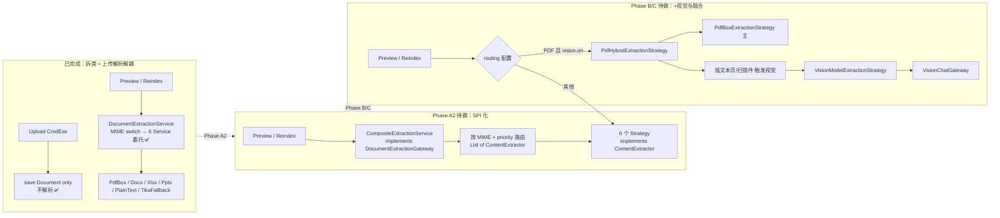
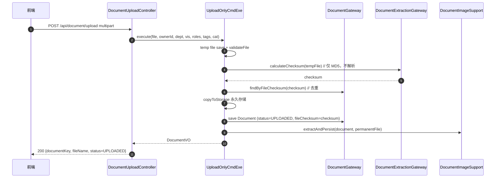
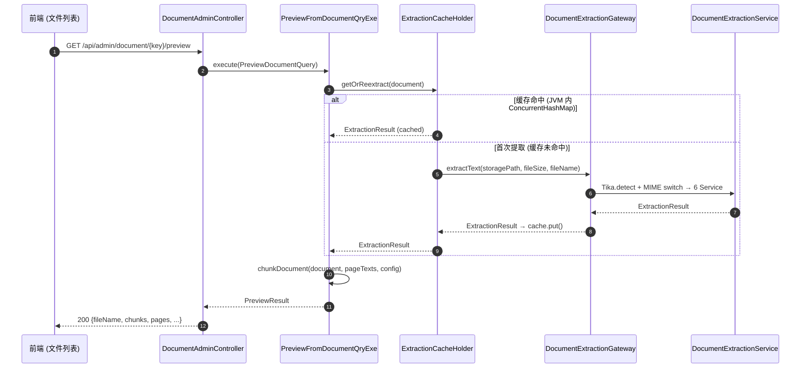
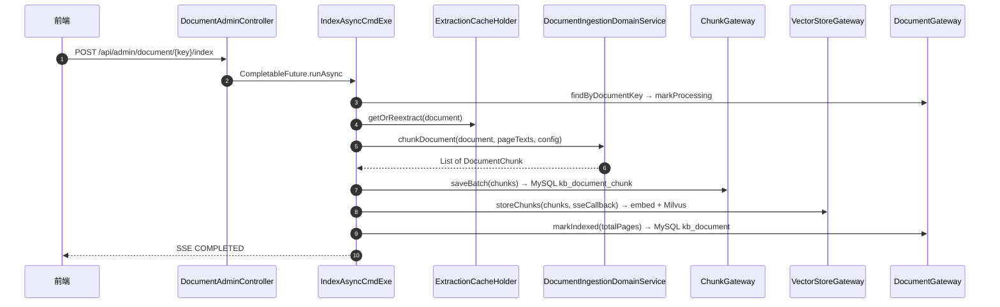
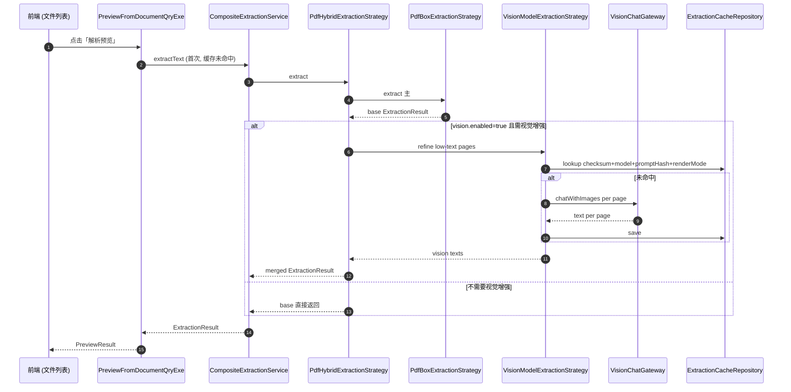
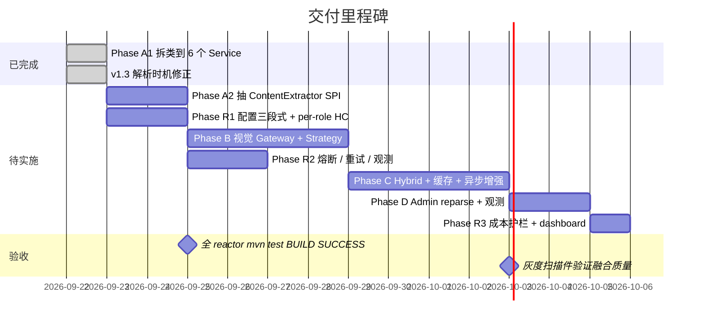
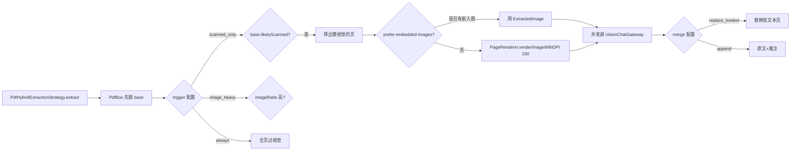

# 文档解析策略模式重构 · 可执行方案

> 版本：v1.4（2026-09-22）
> 交付策略：**先策略化，后视觉**。上传与解析已解耦（上传只存文件，解析手动触发），后续按需引入视觉模型。
> 基线技术栈：COLA 5.0 · Spring Boot 3.4 · Java 21 · PDFBox 3.0.4 · Tika 3.1.0 · POI 5.x · LangChain4j 1.0.1（`langchain4j-open-ai`）
> v1.4 增量：重组文档结构，增加落地进度总览，清理历史修正标记使其反映当前实现现状。
> v1.3 增量：修正解析时机——上传只保存文件，解析由用户点击「解析预览」手动触发。
> v1.2 增量：AGENTS.md 红线全量合规审查；视觉模型调整为 CPU 优先。
> v1.1 增量：新增视觉模型选型与多模型客户端连接治理。

---

## 0. 落地进度总览

### 0.1 各阶段实施状态

| 阶段 | 状态 | 部署版本 | 说明 |
|---|---|---|---|
| **Phase A1** 拆类到 6 个 Service | ✅ 已完成 | V2026092222 | 6 个 `*ExtractionService` 已落地 `infrastructure/extraction/`；`DocumentExtractionService` 改为委托 |
| **v1.3** 解析时机修正 | ✅ 已完成 | V2026092223 | 上传移除 `extractText`，只做 `calculateChecksum` 去重；解析由「解析预览」触发 |
| **Phase A2** 抽 SPI + Composite 顶替 | ✅ 代码完成（待统一部署） | — | `ContentExtractor` SPI + `ExtractionCandidate`/`ExtractionConfig`/`ExtractionStrategyEnum` + 6 个 `*ExtractionStrategy`(infra/extractor) + `CompositeExtractionService`(@Primary) + `ExtractorRoutingProperties`；删 `DocumentExtractionService`；7 测试类 24 用例绿 |
| **Phase B** 视觉模型接入 | ⬜ 待实施 | — | `VisionChatGateway` + `VisionModelExtractionStrategy` + `PageRenderer`；含 `knowledge.llm.vision.*` 配置 + vision per-role HttpClient |
| **Phase C** PDF Hybrid + 持久缓存 | ⬜ 待实施 | — | `PdfHybridExtractionStrategy` + `kb_extraction_cache` + 异步增强 |
| **Phase D** Admin reparse + 观测 | ⬜ 待实施 | — | reparse 端点 + Micrometer 指标 + 成本护栏 |
| **Phase R** 多模型连接治理 | 🔶 R1 代码完成 | — | R1（chat/embedding 三段式 `@ConfigurationProperties` + `LlmClientConfig` per-role `HttpClientBuilder` + `.env` 密钥边界 + 接线测试）✅；vision 配置并入 B；R2 熔断/重试/指标、R3 成本护栏/Grafana 待实施 |

### 0.2 当前实现概要（已完成部分）

**上传流程**（`UploadOnlyCmdExe` / `UploadFromFileCmdExe`）：
临时落盘 → MD5 去重（`calculateChecksum`）→ 永久存储 → 保存 Document（status=UPLOADED）→ 抽取图片元数据 → 发布创建事件。**不调用任何文本解析**。

**解析预览流程**（`PreviewFromDocumentQryExe`）：
用户点击「解析预览」→ `ExtractionCacheHolder.getOrReextract(document)` → 缓存命中直接返回 / 缓存未命中调 `DocumentExtractionGateway.extractText()` 首次提取 → 分块 → 返回 `PreviewResult`。

**文本提取**（`DocumentExtractionService`）：
Tika MIME 检测 → switch 路由到 6 个独立 Service（`PdfBoxExtractionService` / `DocxExtractionService` / `XlsxExtractionService` / `PptxExtractionService` / `PlainTextExtractionService` / `TikaFallbackExtractionService`）。

### 0.3 剩余待实施项（按优先级排序）

1. **Phase A2**：抽 `ContentExtractor` SPI，把 6 个 Service 改为实现 SPI 的 Strategy，用 `CompositeExtractionService` 顶替当前 `DocumentExtractionService` 的 switch 分派
2. **Phase R1**（可与 A2 并行）：三段式 LLM 配置 + per-role HttpClient bean + 密钥 env 边界
3. **Phase B**：视觉 Gateway + Strategy + PageRenderer（默认 `enabled=false`）
4. **Phase R2**（B 之前）：Resilience4j 熔断 + Micrometer 观测
5. **Phase C**：PDF Hybrid + `kb_extraction_cache` DB 持久缓存 + 异步增强
6. **Phase D + R3**：Admin reparse 端点 + 成本护栏 + dashboard

---

## 1. 系统架构与时序图

### 1.1 三层演进总览



### 1.2 上传时序（当前实现 ✅）



### 1.3 解析预览时序（当前实现 ✅）



### 1.4 入库时序（当前实现 ✅）



### 1.5 解析预览时序（Phase C 目标态，视觉增强）



### 1.6 阶段依赖 & 建议节奏



---

## 2. Phase A2：SPI 化重构（⬜ 待实施）

### 2.1 目标

- 在 domain 抽 `ContentExtractor` SPI，让 6 个 Service 实现它；
- `DocumentExtractionGateway` 实现改为 `CompositeExtractionService`（按配置 + `supports` 路由）；
- 现有 `DocumentExtractionService` 删除（不留 `@Deprecated` 中转）。

### 2.2 新增文件清单

| 层 | 路径 | 说明 |
|---|---|---|
| domain | `.../domain/gateway/ContentExtractor.java` | SPI |
| domain | `.../domain/model/valueobject/ExtractionCandidate.java` | 路由输入参数对象 |
| domain | `.../domain/model/valueobject/ExtractionConfig.java` | 全局配置 VO |
| domain | `.../domain/enums/ExtractionStrategyEnum.java` | 策略枚举 |
| infra | `.../infrastructure/extractor/PdfBoxExtractionStrategy.java` | 从 `PdfBoxExtractionService` 改名 + `implements ContentExtractor` |
| infra | `.../infrastructure/extractor/DocxExtractionStrategy.java` | 同上 |
| infra | `.../infrastructure/extractor/XlsxExtractionStrategy.java` | 同上 |
| infra | `.../infrastructure/extractor/PptxExtractionStrategy.java` | 同上 |
| infra | `.../infrastructure/extractor/PlainTextExtractionStrategy.java` | 同上 |
| infra | `.../infrastructure/extractor/TikaFallbackExtractionStrategy.java` | 同上 |
| infra | `.../infrastructure/extractor/CompositeExtractionService.java` | `@Primary` 顶替 |
| infra | `.../infrastructure/config/ExtractorRoutingProperties.java` | `@ConfigurationProperties("knowledge.extractor")` |
| test | `*StrategyTest.java` ×6 + `CompositeExtractionServiceTest.java` | 路由矩阵单测 |

### 2.3 关键签名

**domain SPI**：

```java
package com.mouhin.knowledge.repository.domain.gateway;

import com.mouhin.knowledge.repository.domain.model.valueobject.ExtractionCandidate;
import com.mouhin.knowledge.repository.domain.model.valueobject.ExtractionResult;
import java.io.IOException;

/**
 * 单一文档族的解析策略 SPI（COLA 分层：接口在 domain，实现落 infrastructure/extractor）。
 *
 * <p>CompositeExtractionService 按 priority 升序遍历注入的实现列表，
 * 命中第一个 supports=true 的执行。
 *
 * @author mouhinU
 * @date 2026-09-23
 */
public interface ContentExtractor {

    /** 策略唯一标识，与 ExtractionStrategyEnum 对齐。 */
    String name();

    /** 数字小者优先。Composite 用其排序，保证路由稳定。 */
    int priority();

    /** 路由谓词：candidate 命中本策略则返回 true。不得有副作用。 */
    boolean supports(ExtractionCandidate candidate);

    /** 执行提取。异常向 Composite 冒泡，由 Composite 决定 fallback。 */
    ExtractionResult extract(ExtractionCandidate candidate) throws IOException;
}
```

**candidate VO**：

```java
package com.mouhin.knowledge.repository.domain.model.valueobject;

import java.nio.file.Path;
import java.util.List;
import java.util.Map;

/**
 * 解析策略的路由 + 执行输入参数对象（红线 #11：参数 >3 封装为 record）。
 *
 * @param filePath       已归一化的绝对路径
 * @param fileSize       字节数
 * @param fileName       原始文件名
 * @param mimeType       Tika 检测结果
 * @param nativeHints    预扫描提示（PDF: totalPages/ocrRecommended/perPageTextLens）
 * @param embeddedImages 预取嵌入图（可空）
 * @param config         合并后的解析配置
 */
public record ExtractionCandidate(
        Path filePath,
        long fileSize,
        String fileName,
        String mimeType,
        Map<String, Object> nativeHints,
        List<ExtractedImage> embeddedImages,
        ExtractionConfig config) {}
```

**strategy enum**：

```java
package com.mouhin.knowledge.repository.domain.enums;

public enum ExtractionStrategyEnum {
    PDF_BOX, DOCX, XLSX, PPTX, PLAIN_TEXT, TIKA_FALLBACK,
    /** Phase B 起 */ VISION,
    /** Phase C 起 */ PDF_HYBRID
}
```

**Composite 骨架**（infra）：

```java
@Service
@Primary
@Slf4j
public class CompositeExtractionService implements DocumentExtractionGateway {

    private final List<ContentExtractor> extractors;
    private final Tika tika;
    private final ExtractorRoutingProperties routing;

    public CompositeExtractionService(
            List<ContentExtractor> extractors,
            ExtractorRoutingProperties routing) {
        this.extractors = extractors;
        this.routing = routing;
        this.tika = new Tika();
    }

    @Override
    public ExtractionResult extractText(Path filePath, long fileSize, String fileName)
            throws IOException {
        Path sanitized = filePath.toAbsolutePath().normalize();
        String mime = tika.detect(sanitized);
        ExtractionCandidate candidate = buildCandidate(sanitized, fileSize, fileName, mime);
        List<ContentExtractor> stack = resolveStack(mime);

        IOException lastError = null;
        for (ContentExtractor ex : stack) {
            if (!ex.supports(candidate)) continue;
            try {
                ExtractionResult r = ex.extract(candidate);
                log.info("extract ok [strategy={}, doc={}]", ex.name(), fileName);
                return r;
            } catch (IOException e) {
                lastError = e;
                log.warn("extract failed, fallback [strategy={}, msg={}]",
                        ex.name(), e.getMessage());
            }
        }
        if (lastError != null) throw lastError;
        return ExtractionResult.empty();
    }

    // validateFile / extractFromPath / calculateChecksum 委托即可
}
```

### 2.4 具体拆分步骤

1. 在 domain 加 §2.3 的 4 个新类型；
2. 把现有 6 个 `*ExtractionService` 改名 `*ExtractionStrategy` 并 `implements ContentExtractor`；`priority()` 返回 10/20/30/40/50/60；
3. 新增 `ExtractorRoutingProperties`；默认 routing 空 → 走内置 MIME→枚举映射；
4. 新增 `CompositeExtractionService` 标 `@Primary`；删除 `DocumentExtractionService`；
5. 测试拆到 6 个 `*StrategyTest` + 新增 `CompositeExtractionServiceTest`；
6. `./mvnw -pl knowledge-web -am test` → BUILD SUCCESS。

### 2.5 回滚位

`git revert` PR-A2 即回到 A1 状态（6 个 Service 已拆类但未 SPI 化），完全无损。

---

## 3. Phase B：视觉模型接入（⬜ 待实施，默认关闭）

### 3.1 目标

- 新增 `VisionChatGateway` domain 端口 + `OpenAiCompatibleVisionChatGateway` 实现（复用 `langchain4j-open-ai`，不新增 GAV）；
- 新增 `VisionModelExtractionStrategy implements ContentExtractor`；
- 新增 `PageRenderer` 工具类（PDFBox 3.x `PDFRenderer.renderImageWithDPI`）；
- 默认 `enabled=false`，`routing` 里不含 VISION。

### 3.2 新增文件

| 层 | 路径 |
|---|---|
| domain | `.../gateway/VisionChatGateway.java` |
| domain | `.../model/valueobject/VisionChatRequest.java` |
| infra | `.../llm/OpenAiCompatibleVisionChatGateway.java` |
| infra | `.../extractor/VisionModelExtractionStrategy.java` |
| infra | `.../extractor/PageRenderer.java` |
| infra | `.../config/VisionModelConfig.java` |
| infra | `.../config/InfraExecutorConfig.java` 加 `@Bean visionExecutor` |
| test | `VisionModelExtractionStrategyTest.java` + `OpenAiCompatibleVisionChatGatewayTest.java` |

### 3.3 关键签名

```java
// domain 端口
package com.mouhin.knowledge.repository.domain.gateway;

import com.mouhin.knowledge.repository.domain.model.valueobject.VisionChatRequest;

/**
 * 视觉模型对话端口（COLA domain 层）。
 *
 * <p>实现方严禁把 base64 图片内容写入日志或异常消息（AGENTS.md 红线 #4）。
 *
 * @author mouhinU
 * @date 2026-09-23
 */
public interface VisionChatGateway {

    /** 单轮多模态对话：文本指令 + 图像 → 模型返回纯文本。 */
    String chatWithImages(VisionChatRequest request);
}
```

```java
// infra 策略
@Service
@Order(70)
@Slf4j
public class VisionModelExtractionStrategy implements ContentExtractor {

    private static final int PRIORITY = 70;
    private final VisionChatGateway visionChatGateway;
    private final PageRenderer pageRenderer;
    private final VisionExtractionProperties props;

    public VisionModelExtractionStrategy(
            VisionChatGateway visionChatGateway,
            PageRenderer pageRenderer,
            VisionExtractionProperties props) {
        this.visionChatGateway = visionChatGateway;
        this.pageRenderer = pageRenderer;
        this.props = props;
    }

    @Override
    public String name() { return "VISION"; }

    @Override
    public int priority() { return PRIORITY; }

    @Override
    public boolean supports(ExtractionCandidate c) {
        return props.isEnabled() && isImageOrScannedPdf(c);
    }

    @Override
    public ExtractionResult extract(ExtractionCandidate candidate) throws IOException {
        List<byte[]> images = resolveImageSources(candidate);
        List<String> texts = invokeVisionPerPage(images);
        return assembleResult(candidate, texts);
    }

    // resolveImageSources / invokeVisionPerPage / assembleResult 各 ≤50 行
}
```

### 3.4 视觉增强触发条件



### 3.5 测试矩阵

| 维度 | 用例 |
|---|---|
| supports 路由 | PDF + scanned / image 文件 / Office / 非视觉 MIME |
| 图片源优先级 | ExtractedImage 有 → 用；无 → renderImageWithDPI |
| 单页/多页/混合页 | mock gateway 返回文本 |
| 超时/空返回/异常 | 降级不抛，只 warning |
| Gateway 集成 | WireMock OpenAI → 3 图一次调用 → 断言 payload |

---

## 4. Phase C：PDF Hybrid + 持久缓存（⬜ 待实施）

### 4.1 目标

- `PdfHybridExtractionStrategy`：PDFBox 主 + 视觉补扫描页；
- `kb_extraction_cache` 表：跨进程持久缓存；
- 预览时按需异步增强（不阻塞用户）。

### 4.2 新增文件

| 层 | 路径 |
|---|---|
| infra | `.../extractor/PdfHybridExtractionStrategy.java`（`@Order(5)`） |
| domain | `.../gateway/ExtractionCacheRepository.java` |
| infra | `.../persistence/gateway/ExtractionCacheRepositoryImpl.java` |
| infra | `.../persistence/dataobject/ExtractionCacheDO.java` |
| app | `.../executor/docingestion/ExtractEnhanceAsyncCmdExe.java` |
| infra/resources | Flyway `V<next>__create_extraction_cache.sql` |

### 4.3 `kb_extraction_cache` 表

```sql
CREATE TABLE kb_extraction_cache (
  id BIGINT AUTO_INCREMENT PRIMARY KEY,
  checksum VARCHAR(64) NOT NULL,
  strategy VARCHAR(30) NOT NULL,
  model_name VARCHAR(100),
  prompt_hash VARCHAR(64),
  render_mode VARCHAR(20) NOT NULL,
  result_json CLOB NOT NULL,
  created_at TIMESTAMP DEFAULT CURRENT_TIMESTAMP,
  updated_at TIMESTAMP DEFAULT CURRENT_TIMESTAMP,
  UNIQUE KEY uk_cache (checksum, strategy, model_name, prompt_hash, render_mode)
);
```

### 4.4 事务边界（红线 #8）

`ExtractEnhanceAsyncCmdExe`：
- **无 `@Transactional`**
- `CompletableFuture.runAsync(() -> { ... }, visionExecutor)`
- 视觉 HTTP 全在异步线程
- DB 写入只在完成后短暂开事务

### 4.5 视觉增强配置

```yaml
knowledge.extractor.vision.enhance-mode:
  on-preview: true              # 预览时触发解析+视觉
  on-reindex: true              # reindex 时亦走视觉
  sync-on-preview: false        # 预览时同步跑视觉（默认关）
  async-after-preview: true     # 预览先返回原生结果，后台异步补视觉
```

### 4.6 并发与超时

- `visionExecutor`：`corePool=2, max=4, queue=64, CallerRunsPolicy`
- 每文档 `max-pages-per-doc=20`；单页 `timeout-seconds=60`；整文档 `max-total-seconds=300`
- 熔断：连续 N 次超时 → 降级到 PDFBox only（`circuit-breaker.threshold=5`）

---

## 5. Phase D：Admin 重解析 + 观测（⬜ 待实施）

### 5.1 Admin 端点

```java
@PostMapping("/api/admin/document/{key}/reparse")
public ResponseEntity<Map<String, String>> reparse(
        @PathVariable String key,
        @RequestParam(defaultValue = "auto") String strategy) {
    reparseCmdExe.submit(key, strategy);   // 异步，返回 202
    return ResponseEntity.accepted()
            .body(Map.of("documentKey", key, "status", "ENQUEUED"));
}
```

`DocumentUploadRequest` + `ChunkUploadRequest` 各加：

```java
/** 可选：强制指定解析策略栈（枚举名 CSV）。留空走配置默认。 */
private String parsingStrategy;
```

后端白名单校验（枚举 `values()`），非法值回退配置默认。

### 5.2 Micrometer 观测

- `extraction.invocations{strategy,mime,outcome}` counter
- `extraction.latency{strategy}` timer（P50/P95/P99）
- `extraction.cache.hit{strategy}` / `extraction.cache.miss{strategy}` counter
- `extraction.vision.tokens{model}` counter
- `extraction.vision.failures{reason}` counter（reason=timeout|429|5xx|schema）
- tag 只放策略名/MIME/outcome/reason，**不放** documentKey/fileName（红线 #4）

### 5.3 成本护栏

```yaml
knowledge.extractor.vision.budget:
  daily-pages-per-user: 500
  max-tokens-per-request: 4000
  enforcement: log-only        # 或 enforce
```

---

## 6. 完整配置示例（目标态 `application.yml`）

```yaml
knowledge:
  extractor:
    enabled-strategies: [PDF_BOX, DOCX, XLSX, PPTX, PLAIN_TEXT, TIKA_FALLBACK]
    routing:
      application/pdf:                              [PDF_HYBRID, PDF_BOX]
      application/vnd.openxmlformats-officedocument.wordprocessingml.document: [DOCX]
      application/vnd.openxmlformats-officedocument.spreadsheetml.sheet:        [XLSX]
      application/vnd.openxmlformats-officedocument.presentationml.presentation: [PPTX]
      text/plain:                                   [PLAIN_TEXT]
      text/csv:                                     [PLAIN_TEXT]
      text/html:                                    [PLAIN_TEXT]
      text/markdown:                                [PLAIN_TEXT]
      image/png:                                    [VISION, TIKA_FALLBACK]
      image/jpeg:                                   [VISION, TIKA_FALLBACK]
    default-stack:                                  [TIKA_FALLBACK]
    vision:
      enabled: false                    # 全局回滚开关
      trigger: scanned_only             # scanned_only | image_heavy | always
      prefer-embedded-images: true
      render-fallback-dpi: 150
      min-text-len-per-page: 200
      max-pages-per-doc: 20
      max-bytes-per-image: 4194304      # 4 MB
      merge: replace_lowtext            # replace_lowtext | append | replace_all
      timeout-seconds: 60
      max-total-seconds-per-doc: 300
      enhance-mode:
        on-preview: true
        on-reindex: true
        sync-on-preview: false
        async-after-preview: true
      circuit-breaker:
        threshold: 5
        cooldown-seconds: 60
      budget:
        daily-pages-per-user: 500
        max-tokens-per-request: 4000
        enforcement: log-only
  llm:
    chat:
      provider: deepseek
      base-url: https://api.deepseek.com/v1
      api-key:  ${LLM_CHAT_API_KEY:}
      model-name: deepseek-chat
      connect-timeout-seconds: 5
      read-timeout-seconds: 120
      call-timeout-seconds: 180
      http-version: HTTP_1_1
      max-idle-connections: 8
      keep-alive-seconds: 300
      retry-max-attempts: 3
    embedding:
      base-url: ${LLM_EMBED_BASE_URL:http://knowledge-bge-m3:8000/v1}
      api-key:  ${LLM_EMBED_API_KEY:}
      model-name: bge-m3
      connect-timeout-seconds: 2
      read-timeout-seconds: 10
      call-timeout-seconds: 15
      http-version: HTTP_2
      max-idle-connections: 32
      keep-alive-seconds: 300
      retry-max-attempts: 5
      batch-size: 64
    vision:
      enabled: false
      mode: local-cpu                    # local-cpu | cloud-api | local-gpu
      provider: openai-compatible
      base-url: ${LLM_VISION_BASE_URL:http://knowledge-paddleocr-cpu:8080/v1}
      api-key:  ${LLM_VISION_API_KEY:}
      model-name: ${LLM_VISION_MODEL:paddleocr-vl}
      temperature: 0.0
      max-tokens: 4096
      connect-timeout-seconds: 3
      read-timeout-seconds: 30
      call-timeout-seconds: 60
      write-timeout-seconds: 30
      max-idle-connections: 4
      http-version: HTTP_1_1
      retry-max-attempts: 2
```

---

## 7. 测试矩阵总览

| 阶段 | 单元 | 集成 | 手工冒烟 |
|---|---|---|---|
| A2 | Composite 路由矩阵；`supports=false` 跳过；fallback 顺序 | `@SpringBootTest` bean 检查 | 上传 PDF/DOCX → 预览文本非空 → 确认入库 → 状态 INDEXED |
| B | `supports` 矩阵；PageRenderer；Gateway mock | WireMock 假 OpenAI | 配 `vision.enabled=true` → 上传扫描件 → 日志有 `[vision]` |
| C | Hybrid 融合 + 缓存 hit/miss + 熔断降级 | 端到端 reindex HYBRID → 二次同文件缓存 100% 命中 | 真实扫描件 → 观察 base + 增强差异 |
| D | 端点参数校验；策略白名单；配额计数 | MockMvc `POST /reparse?strategy=VISION` | Admin UI → 202 → 状态变化 |
| R | per-role HttpClient 隔离；熔断独立触发 | 模拟一 provider 超时另一不受影响 | 调低 vision timeout → 不影响 chat |

---

## 8. 决策记录（ADR-lite）

| # | 决策 | 理由 | 备选 |
|---|---|---|---|
| D1 | 分两 PR（A1 拆类 ✅ / A2 抽 SPI ⬜） | 每 PR 独立可回滚，风险最小 | 一步到位：diff 巨大难 review |
| D2 | `ExtractionResult` record 不动 | 下游 chunkDocument + 所有测试都吃它 | 加 pageProvenance 破坏测试 |
| D3 | 视觉走 `langchain4j-open-ai` 内建多模态 | 无新 GAV；OpenAI 兼容协议 | 手写 HTTP：代码重复 |
| D4 | 视觉默认 `enabled=false` | 灰度只需配置 | 默认开：需更多护栏 |
| D5 | `async-after-preview` 默认增强 | 预览立即返回原生结果 | 仅 reindex：更保守 |
| D6 | 图像源优先 ExtractedImage → PDFRenderer | 复用已抽图像 | 一律栅格化：内存翻倍 |
| D7 | 缓存 key 加 `render_mode` | 防混缓存 | 只 checksum：静默错乱 |
| D8 | 不动 `DocumentImageSupport` | 图像持久化与 OCR 语义正交 | 一起：耦合 |
| D9 | CPU 本地优先 + 可选云端 + GPU 升级路径 | 无 GPU；PaddleOCR 成熟；改配置即升级 | 直接 GPU：成本高 |
| D10 | 多模型"五独立" | 防一 provider 雪崩全崩 | 全局单例：省内存但脆弱 |

---

## 9. 里程碑与工时

| 里程碑 | 交付物 | 工时 | 状态 |
|---|---|---|---|
| M1 · Phase A1 | 6 个 `*ExtractionService` + 委托 | 2d | ✅ 完成 |
| M1' · 解析时机修正 | 上传不解析 + 预览触发解析 | 0.5d | ✅ 完成 |
| M2 · Phase A2 | `ContentExtractor` SPI + `CompositeExtractionService` | 2d | ⬜ |
| M2' · Phase R1 | 三段配置 + per-role HttpClient + 密钥边界 | 2d | ⬜ |
| M3 · Phase B | `VisionChatGateway` + Strategy + PageRenderer | 4-5d | ⬜ |
| M3' · Phase R2 | Resilience4j 熔断 + Micrometer 观测 | 2d | ⬜ |
| M4 · Phase C | `PdfHybridExtractionStrategy` + `kb_extraction_cache` + 异步增强 | 4-5d | ⬜ |
| M5 · Phase D+R3 | Admin reparse + 成本护栏 + dashboard | 2-3d | ⬜ |

**验收标准（Phase A 全完成后）**：
1. `DocumentExtractionService` 被 `CompositeExtractionService` 顶替或删除；
2. `ContentExtractor` 有 6 个实现，每个独立可测；
3. 全 reactor `mvn test` BUILD SUCCESS；
4. 上传/预览/入库三条链路正常；
5. `docs/rag-domain-guideline.md` 更新为"新增格式须实现 `ContentExtractor` 并注册 routing"。

---

## 10. 风险与缓解

| 风险 | 影响 | 概率 | 缓解 |
|---|---|---|---|
| A2 SPI 化后 `List<ContentExtractor>` 顺序漂移 | 路由不确定 | 低 | `@Order` 硬编码 + 单测断言 |
| 视觉模型返回非文本 | 页面文本丢失 | 中 | gateway schema 校验 + 空返回降级 warning |
| 缓存键设计不当 | 静默错乱 | 中 | 键含 render_mode + 单测 |
| 视觉异步任务拖垮 agentExecutor | 出卷卡顿 | 中 | visionExecutor 独立有界池 |
| PDFBox 3.x OOM | 生产事故 | 低 | max-bytes 前置校验 + try-with-resources |
| 视觉 provider 涨价/API 变更 | 成本/兼容 | 中 | VisionChatGateway 端口隔离，实现可换 |

---

## 11. 视觉模型选型（CPU 优先）

### 11.1 三档候选

| 档位 | 方案 | 硬件 | 单页延迟 | 精度 | 运维 |
|---|---|---|---|---|---|
| CPU 本地 | PaddleOCR-VL CPU 版 | 4核8G+ | 5-15s | ~90% | 低 |
| 云端 API | DashScope qwen-vl-plus | 无本地 | 2-8s | 95%+ | 按量 |
| GPU 本地 | OvisOCR2 / PaddleOCR-VL vLLM | GPU | 1-3s | 96%+ | 高 |

### 11.2 推荐方案

**默认 CPU 本地（PaddleOCR-VL），可选云端增强，有 GPU 后平滑升级。**

升级路径：改 `mode=local-gpu` + 切换 base-url，代码零改动。

### 11.3 上线前验证

golden-PDF 基准打分：20 页 OmniDocBench + 5 份真实扫描件；阈值 CER ≥ 85% 方可上线；不达标切 `mode=cloud-api`。

---

## 12. 多模型客户端连接治理（Phase R）

### 12.1 五独立原则

| 维度 | 粒度 | 理由 |
|---|---|---|
| HttpClient | per-role (chat/embed/vision) | dispatcher 隔离 |
| Timeout | per-role | 出卷 120s / 向量 10s / 视觉 300s |
| 线程池 | per-role | 互不争用 |
| 熔断 | per-provider + per-role | 一崩不影响其他 |
| 密钥 | per-role env var | 轮换 + 最小权限 |

### 12.2 Per-role 连接参数

| 角色 | Provider | connect | read | call | pool | HTTP | retry |
|---|---|---|---|---|---|---|---|
| Chat | DeepSeek | 5s | 120s | 180s | 8 | 1.1 | 3 |
| Embedding | BGE-M3 | 2s | 10s | 15s | 32 | 2 | 5 |
| Vision(CPU) | PaddleOCR | 3s | 30s | 60s | 4 | 1.1 | 2 |
| Vision(Cloud) | DashScope | 3s | 60s | 120s | 8 | 1.1 | 3 |
| Vision(GPU) | OvisOCR2 | 3s | 300s | 360s | 4 | 1.1 | 2 |

### 12.3 LangChain4j 陷阱

`OpenAiChatModel.builder()` 不显式注入 `OkHttpClient` 时会各自 `new` → 看似隔离实则内存翻倍。正确做法：`@Bean` per-role + `@Qualifier` 注入。

### 12.4 子阶段交付

| 子阶段 | 交付物 | 前置依赖 |
|---|---|---|
| R1 (2d) | `LlmClientConfig` + 三段 `@ConfigurationProperties` + `.env` 密钥边界 | 可与 A2 并行 |
| R2 (2d) | Resilience4j 熔断 + 重试 + Micrometer 指标 | B 之前完成 |
| R3 (1.5d) | 成本护栏 + Grafana panel | 与 D 合并 |

---

## 13. AGENTS.md 红线对照

| 红线 | 方案合规 |
|---|---|
| **#1** 构造器注入 | 所有示例完整构造器；禁 `@Autowired` 字段 |
| **#2** 禁魔法值 | `PRIORITY=70` 等抽为 `static final`；`HintKeys.*` 常量 |
| **#3** 格式 | 4 空格缩进，≤120 字符，UTF-8/LF |
| **#4** 日志 `@Slf4j` + `{}` | 禁回显 base64/token；tag 不放业务 ID |
| **#5** SQL `#{}` | Flyway DDL 无参数化；Mapper XML 严格 `#{}` |
| **#6** DO 不出 infra | `ExtractionCacheDO` 仅在 infra；domain 只暴露端口 |
| **#7** domain 纯净 | SPI 在 `domain.gateway`；不依赖 app/infra |
| **#8** LLM 不在事务内 | `ExtractEnhanceAsyncCmdExe` 无 `@Transactional` |
| **#9** Javadoc | 公共类补齐 `@author mouhinU` + `@date` |
| **#10** 不变更框架版本 | 复用 `langchain4j-open-ai`，不新增 GAV |
| **#11** 方法体 ≤50 行，参数 ≤5 | 视觉策略拆 3 私有方法；`ExtractionCandidate` record 封装 |

---

## 14. 待确认问题（精简后 10 个）

> v1.3 已确认 #3（解析时机）。v1.2 收敛了视觉 provider 选型。以下仍待决策：

1. **视觉范围**：仅"扫描型 PDF + 图片型文件"，还是含 Office 内嵌图？
2. **融合方式**：`replace_lowtext`（默认），`append`，`replace_all`？
3. **默认 provider**：确认走 CPU 本地（PaddleOCR CPU）？还是直接对接某个云端 API？
4. **缓存持久**：Phase C 用 DB（跨进程），还是维持 JVM 内 `ConcurrentHashMap`？
5. **成本护栏**：只软限（log-only），还是硬限（enforce 拒服）？
6. **前端契约**：`reparse` 端点用 202 + SSE，还是 200 + 长轮询？
7. **视觉精度门槛**：CPU 模式 CER < 85% 时是否接受切 `cloud-api` 作为默认？
8. **Phase R1 时机**：是否可与 Phase A2 并行开工？
9. **`UploadAndProcessCmdExe`**：当前无调用方且仍含 `extractText`，是否删除或对齐 v1.3 行为？
10. **文档同步**：Phase A2 合入时是否同时改写 `docs/rag-domain-guideline.md` §一？
