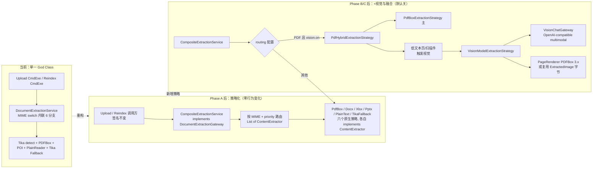
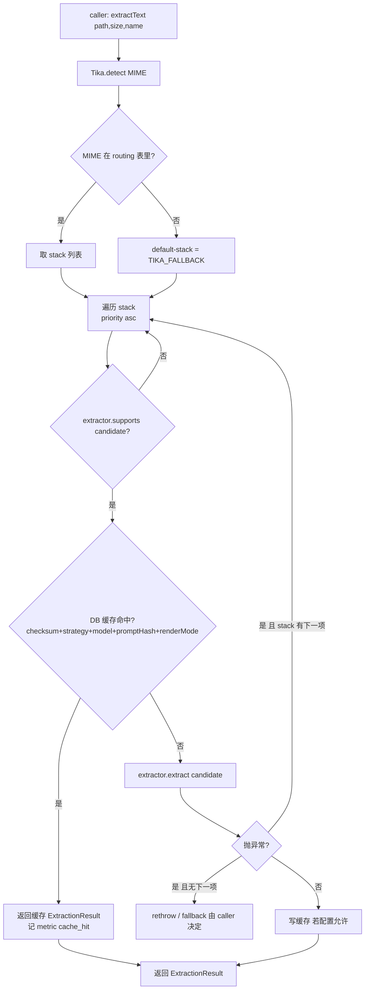
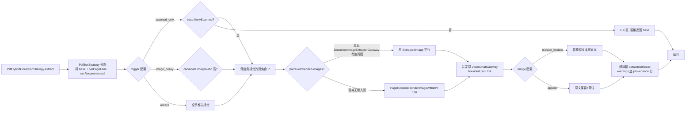
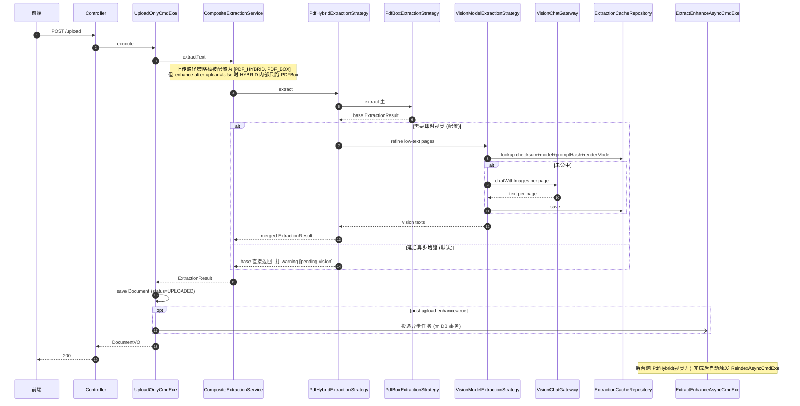
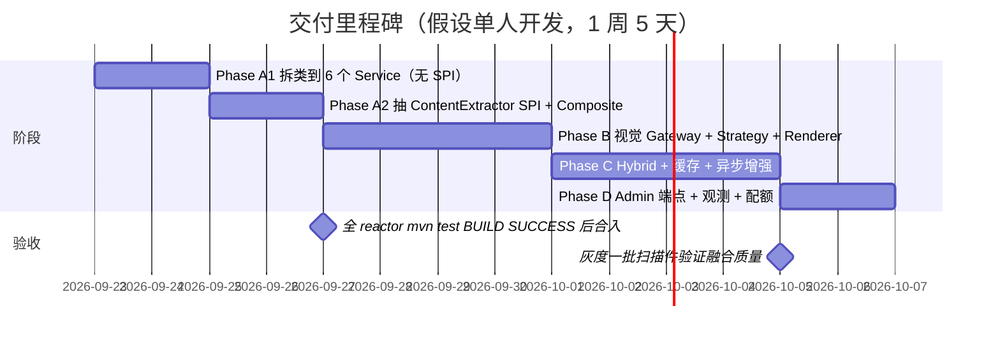

# 文档解析策略模式重构 · 可执行方案

> 版本：v1.1（2026-09-22）
> 交付策略：**先策略化，后视觉**。Phase A 零行为变化（只重构现有能力），Phase B/C/D 才引入视觉模型。
> 基线技术栈：COLA 5.0 · Spring Boot 3.4 · Java 21 · PDFBox 3.0.4 · Tika 3.1.0 · POI 5.x · LangChain4j 1.0.1（`langchain4j-open-ai`）
> v1.1 增量：新增 §12 视觉模型选型（OvisOCR2 vs PaddleOCR-VL-1.6）与 §13 多模型客户端连接治理（Phase R1/R2/R3）；相应修订 §3.3 单一 `VisionChatGateway` 端口决策与 ADR-D3。

---

## 0. 交付边界

| 阶段 | 主题 | 是否引入新能力 | 是否影响前端契约 | 关键交付物 | 工时 |
|---|---|---|---|---|---|
| **Phase A** | 把 `DocumentExtractionService` 的 6 路 MIME switch 拆成显式策略族 + 抽 `ContentExtractor` SPI | **不引入**（纯重构） | 不变 | `ContentExtractor` SPI + 6 个原生策略 + `CompositeExtractionService`；测试全绿 | 3–4 人日 |
| **Phase B** | 引入视觉模型能力，新增 `VisionModelExtractionStrategy`，默认 `enabled=false` | 引入（可关） | 不变（默认关） | `VisionChatGateway` 端口 + OpenAI-compatible 实现 + 视觉策略 + `PageRenderer` | 4–5 人日 |
| **Phase C** | PDF Hybrid（PDFBox 主 + 视觉补扫描页） + 视觉结果持久缓存 + 上传后异步增强 | 引入 | 增加可选响应字段 | `PdfHybridExtractionStrategy` + `kb_extraction_cache` 表 + `ExtractEnhanceAsyncCmdExe` | 4–5 人日 |
| **Phase D** | Admin 手动重解析端点 + 观测 + 成本护栏 + `parsingStrategy` 请求字段 | 引入 | client DTO 加可选字段 | `POST /api/document/{key}/reparse` + Micrometer + 配额 | 2–3 人日 |
| **Phase R** | 多模型客户端连接治理（Chat/Embedding/Vision 独立 HttpClient+超时+线程池+熔断+密钥，见 §13） | 不引入新解析能力 | 不变 | `LlmClientConfig` 三段式 + `model-calls` 指标 + `.env`/Secret 边界 + 熔断矩阵 | 5.5 人日（R1 2 + R2 2 + R3 1.5） |

**依赖顺序**：A 完成后 B/C 可并行；D 依赖 B、C；**R1（配置对齐 + per-role HttpClient bean）可与 A 并行启动**，R2（熔断/重试/观测）在 B 之前完成，R3（成本护栏 + 面板）与 D 合并交付。任一阶段结束都是独立可发布产物；B/C/D 均可通过 `knowledge.extractor.vision.enabled=false` 一键回退到"只有 Phase A 后的策略化原生提取"。

---

## 1. 流程图

### 1.1 三层演进总览



### 1.2 `CompositeExtractionService` 路由决策（Phase C 完整态）



### 1.3 视觉增强触发条件（Phase C，`vision.enabled=true` 时）



### 1.4 上传时序（Phase A 完成后，行为与今天**完全一致**）

```mermaid
sequenceDiagram
    autonumber
    participant FE as 前端
    participant CTL as DocumentUploadController
    participant EXE as UploadOnlyCmdExe
    participant GW as DocumentExtractionGateway
    participant CMP as CompositeExtractionService
    participant PDF as PdfBoxExtractionStrategy
    participant STO as DocumentImageSupport

    FE->>CTL: POST /api/document/upload multipart
    CTL->>EXE: execute(file, ownerId, dept, vis, roles, tags, cat)
    EXE->>EXE: temp file save + validateFile
    EXE->>GW: extractText tmp,size,name
    GW->>CMP: (Spring 注入到 CompositeExtractionService)
    CMP->>CMP: Tika.detect + build ExtractionCandidate
    CMP->>PDF: supports? -> true; extract
    PDF-->>CMP: ExtractionResult
    CMP-->>GW: ExtractionResult
    GW-->>EXE: ExtractionResult
    EXE->>EXE: checksum dedup + copyToStorage + save Document
    EXE->>STO: extractAndPersist document,tmpFile
    STO-->>EXE: DocumentImage rows saved
    EXE-->>CTL: DocumentVO
    CTL-->>FE: 200 {documentKey,fileName,status,message}
```

Phase A 的验收标准就是**这张序列图完全等价于今天的实现**（除了 `DocumentExtractionService` 名字被 `CompositeExtractionService` 顶替），响应字节/字段/时序都不变。

### 1.5 上传时序（Phase C 完成 + `vision.enabled=true`）



### 1.6 阶段依赖 & 建议节奏



---

## 2. Phase A：策略化重构（**先把现在的能力实现成策略，零功能新增**）

### 2.1 目标与非目标

**目标**：
- 把 `DocumentExtractionService` 里内联的 6 路 MIME switch 拆到 6 个独立类；
- 在 domain 抽 `ContentExtractor` SPI，让 6 个类都实现它；
- `DocumentExtractionGateway` 实现改为 `CompositeExtractionService`（按配置 + `supports` 路由）；
- 现有 152 个测试全绿；行为字节级不变。

**非目标**：不引入任何视觉/OCR；不动 `ExtractionResult` 记录本体；不动上传/索引调用方签名。

### 2.2 新增文件清单

| 层 | 路径 | 说明 |
|---|---|---|
| domain | `knowledge-domain/src/main/java/com/mouhin/knowledge/repository/domain/gateway/ContentExtractor.java` | SPI，见 §2.4 |
| domain | `knowledge-domain/src/main/java/com/mouhin/knowledge/repository/domain/model/valueobject/ExtractionCandidate.java` | 路由输入参数对象 |
| domain | `knowledge-domain/src/main/java/com/mouhin/knowledge/repository/domain/model/valueobject/ExtractionConfig.java` | 全局配置 VO |
| domain | `knowledge-domain/src/main/java/com/mouhin/knowledge/repository/domain/enums/ExtractionStrategyEnum.java` | 策略枚举 |
| infra | `knowledge-infrastructure/src/main/java/com/mouhin/knowledge/repository/infrastructure/extractor/AbstractExtractionStrategy.java` | 公共工具父类（可选，或全走组合） |
| infra | `knowledge-infrastructure/.../extractor/PdfBoxExtractionStrategy.java` | 搬 `extractPdf` |
| infra | `knowledge-infrastructure/.../extractor/DocxExtractionStrategy.java` | 搬 `extractWord` |
| infra | `knowledge-infrastructure/.../extractor/XlsxExtractionStrategy.java` | 搬 `extractExcel` |
| infra | `knowledge-infrastructure/.../extractor/PptxExtractionStrategy.java` | 搬 `extractPowerPoint` |
| infra | `knowledge-infrastructure/.../extractor/PlainTextExtractionStrategy.java` | 搬 `extractPlainText` |
| infra | `knowledge-infrastructure/.../extractor/TikaFallbackExtractionStrategy.java` | 搬 `extractGeneric` |
| infra | `knowledge-infrastructure/.../extractor/CompositeExtractionService.java` | `@Primary` 顶替 `DocumentExtractionService` |
| infra | `knowledge-infrastructure/.../config/ExtractorRoutingProperties.java` | `@ConfigurationProperties("knowledge.extractor")` |
| test | `knowledge-infrastructure/src/test/java/.../extractor/*StrategyTest.java` ×6 | 每策略单元，用现有 `DocumentExtractionServiceTest` 里的 fixture 拆过去 |
| test | `knowledge-infrastructure/src/test/java/.../extractor/CompositeExtractionServiceTest.java` | 路由矩阵单测 |

### 2.3 修改文件清单

| 文件 | 变更 |
|---|---|
| `knowledge-infrastructure/.../pdf/DocumentExtractionService.java` | 标 `@Deprecated`，实现委托到 `CompositeExtractionService`；一个 Phase 之后（即 Phase D 末）删除。或者直接改名 `CompositeExtractionService` 并调整包路径 —— **推荐后者**，不留历史包袱。 |
| `knowledge-infrastructure/.../pdf/EnhancedPdfTextExtractor.java` | 无逻辑改动。仅确保 `PdfExtractionResult.ocrRecommended` + `PageContent.filteredText()` 在 `PdfBoxExtractionStrategy` 中被读取以填充 `ExtractionResult.likelyScanned`。 |
| `knowledge-infrastructure/.../pdf/DocumentExtractionServiceTest.java` | 拆到 6 个策略单测；保留一个 `@SpringBootTest` 冒烟测 `CompositeExtractionService`。 |
| `knowledge-web/src/main/resources/application.yml` | 新增 `knowledge.extractor` 配置块（见 §6）；无值时走内置默认（保持零配置即完全等价于今天行为）。 |

**调用方零改动**：`UploadOnlyCmdExe` / `UploadAndProcessCmdExe` / `UploadFromFileCmdExe` / `ReindexAsyncCmdExe` / `ExtractionCacheHolder` / `PreviewFileQryExe` / `PreviewFromDocumentQryExe` 都通过 `DocumentExtractionGateway` 端口注入，实现类被 Spring 顶替即可。

### 2.4 关键签名（可编译骨架）

**domain SPI**：

```java
package com.mouhin.knowledge.repository.domain.gateway;

import com.mouhin.knowledge.repository.domain.model.valueobject.ExtractionCandidate;
import com.mouhin.knowledge.repository.domain.model.valueobject.ExtractionResult;
import java.io.IOException;

/**
 * 单一文档族的解析策略 SPI（COLA 分层：接口在 domain，实现全部落 infrastructure/extractor）。
 *
 * <p>CompositeExtractionService 按 priority 升序遍历注入的实现列表，命中第一个 supports=true 的执行。
 * 严禁在实现里持有 app/adapter 类型；langchain4j、PDFBox、POI、Tika 只能出现在 infrastructure。
 */
public interface ContentExtractor {

    /** 策略唯一标识，与 {@link com.mouhin.knowledge.repository.domain.enums.ExtractionStrategyEnum} 对齐。 */
    String name();

    /** 数字小者优先。Composite 用其排序，保证路由稳定。 */
    int priority();

    /** 路由谓词：candidate 命中本策略则返回 true。不得有副作用。 */
    boolean supports(ExtractionCandidate candidate);

    /** 执行提取。异常向 Composite 冒泡，由 Composite 决定 fallback 到 stack 下一项或原样抛出。 */
    ExtractionResult extract(ExtractionCandidate candidate) throws IOException;
}
```

**candidate VO**：

```java
package com.mouhin.knowledge.repository.domain.model.valueobject;

import java.nio.file.Path;
import java.util.List;
import java.util.Map;

/**
 * 解析策略的路由 + 执行输入参数对象（红线 #11：参数 >3 封装）。
 *
 * @param filePath       已归一化的绝对路径（toAbsolutePath().normalize()）
 * @param fileSize       字节数
 * @param fileName       原始文件名
 * @param mimeType       Tika 检测结果
 * @param nativeHints    预扫描提示（PDF: totalPages/ocrRecommended/perPageTextLens；Office: 图片数）
 * @param embeddedImages 由 DocumentImageExtractorGateway 预取（可空；仅在配置要求时才预取）
 * @param config         全局 + 请求级合并后的解析配置
 */
public record ExtractionCandidate(
        Path filePath,
        long fileSize,
        String fileName,
        String mimeType,
        Map<String, Object> nativeHints,
        List<ExtractedImage> embeddedImages,
        ExtractionConfig config) {}
```

`nativeHints` 用 `Map<String,Object>` 是**有意识的取舍**：避免为每个 MIME 建不同子类型；键名以常量维护（`HintKeys.TOTAL_PAGES` / `HintKeys.OCR_RECOMMENDED` / `HintKeys.PER_PAGE_TEXT_LENS`），杜绝魔法值（红线 #2）。

**strategy enum**：

```java
package com.mouhin.knowledge.repository.domain.enums;

public enum ExtractionStrategyEnum {
    PDF_BOX, DOCX, XLSX, PPTX, PLAIN_TEXT, TIKA_FALLBACK,
    /** Phase B 起 */ VISION,
    /** Phase C 起 */ PDF_HYBRID
}
```

**Composite 骨架**（infra）：

```java
@Service
@Primary
@Slf4j
public class CompositeExtractionService implements DocumentExtractionGateway {

    private final List<ContentExtractor> extractors;                 // Spring 按 @Order 注入
    private final Tika tika;                                         // 只用于 detect
    private final ExtractorRoutingProperties routing;

    public CompositeExtractionService(
            List<ContentExtractor> extractors,
            ExtractorRoutingProperties routing) {
        this.extractors = extractors;
        this.routing = routing;
        this.tika = new Tika();
    }

    @Override
    public ExtractionResult extractText(Path filePath, long fileSize, String fileName)
            throws IOException {
        Path sanitized = filePath.toAbsolutePath().normalize();
        String mime = tika.detect(sanitized);
        ExtractionCandidate candidate = buildCandidate(sanitized, fileSize, fileName, mime);
        List<ContentExtractor> stack = resolveStack(mime);

        IOException lastError = null;
        for (ContentExtractor ex : stack) {
            if (!ex.supports(candidate)) continue;
            try {
                ExtractionResult r = ex.extract(candidate);
                log.info("extract ok [strategy={}, doc={}, mime={}]", ex.name(), fileName, mime);
                return r;
            } catch (IOException e) {
                lastError = e;
                log.warn("extract failed, fallback [strategy={}, doc={}, msg={}]",
                        ex.name(), fileName, e.getMessage());
            }
        }
        if (lastError != null) throw lastError;
        return ExtractionResult.empty();     // 无策略命中时的兜底空结果
    }

    // validateFile / extractFromPath / calculateChecksum 三个方法原样搬过来即可
}
```

`ExtractionResult.empty()` 需要在现有 record 里加一个静态工厂（**新增方法，不动 record 本体**，二进制兼容）。

### 2.5 具体拆分步骤（PR-A1 + PR-A2）

**PR-A1：只拆类，不引 SPI**（1–2 人日，最小风险）
1. `DocumentExtractionService.extractPdf` 方法体整段搬到新类 `PdfBoxExtractionService`，改为 public `ExtractionResult extract(Path)`；`DocumentExtractionService` 构造器注入它，`extractPdf(...)` 委托。
2. `extractWord` → `DocxExtractionService`；`extractExcel` → `XlsxExtractionService`；`extractPowerPoint` → `PptxExtractionService`；`extractPlainText` → `PlainTextExtractionService`；`extractGeneric` → `TikaFallbackExtractionService`。
3. 每搬一个跑一次 `./mvnw -pl knowledge-infrastructure -am test`；全绿即合并。
4. `DocumentExtractionService` 只保留 MIME 检测 + switch 分派 + `validateFile` + `calculateChecksum`，行数从 ~360 降到 ~80。

**PR-A2：抽 `ContentExtractor` SPI + `CompositeExtractionService`**（1–2 人日）
1. 在 domain 加 §2.4 的 4 个新类型（`ContentExtractor` / `ExtractionCandidate` / `ExtractionConfig` / `ExtractionStrategyEnum`）。
2. 把 A1 里 6 个 `*ExtractionService` 改名 `*ExtractionStrategy` 并 `implements ContentExtractor`；`name()` 返回枚举名，`priority()` 返回 10/20/30/40/50/60，`supports(c)` 判 `c.mimeType()` 或 `config.routing`。
3. 新增 `ExtractorRoutingProperties` `@ConfigurationProperties("knowledge.extractor")`；默认 `routing` 空 → 走内置 MIME→ 枚举映射（`application/pdf → [PDF_BOX]` 等）。
4. 新增 `CompositeExtractionService`（见 §2.4）标 `@Primary implements DocumentExtractionGateway`；把 `DocumentExtractionService` 直接**删除**（不留 `@Deprecated` 中转类，减少历史包袱）。
5. `DocumentExtractionServiceTest` 拆到 6 个 `*StrategyTest`；新增 `CompositeExtractionServiceTest` 覆盖：单命中、stack 顺序、supports 过滤、fallback 顺序。
6. `./mvnw -pl knowledge-web -am test`（含所有下游调用方）→ BUILD SUCCESS；容器起一次冒烟 `curl /actuator/health`。

### 2.6 每步验证命令

```bash
# 每个 PR 前后都要跑
./mvnw -q -pl knowledge-infrastructure spotless:apply
./mvnw -pl knowledge-web -am test
# 期望：domain 28 + infra 3+ 新增测试 + app 105 + web 16 全绿

# 冒烟：本地起容器验证上传/预览/reindex 三条真实链路
bash scripts/docker-build.sh
IMAGE_VER=<newtag> docker compose up -d --no-deps --force-recreate knowledge-app
curl http://localhost:8091/actuator/health       # {"status":"UP"}
# 手工：上传一个 PDF → 预览文本非空；上传一个 DOCX → 预览文本非空；点 reindex → 状态到 INDEXED
```

### 2.7 Phase A 的回滚位

Phase A 合入后如果生产冒烟出问题：`git revert` 整个 PR-A2 即可回到 A1 状态（6 个 Service 已拆类但未 SPI 化），完全无损。PR-A1 本身是纯搬代码，回滚成本更低。

---

## 3. Phase B：视觉模型接入（**默认关闭**，只在配置里开启）

### 3.1 目标

- 新增 `VisionChatGateway` domain 端口 + `OpenAiCompatibleVisionChatGateway` 实现（**复用现有 `langchain4j-open-ai`，不新增 GAV**）；
- 新增 `VisionModelExtractionStrategy implements ContentExtractor`；
- 新增 `PageRenderer` 工具类（PDFBox 3.x `Loader.loadPDF` + `PDFRenderer.renderImageWithDPI`）；
- 上传/索引路径**保持不变**（`routing` 里默认不含 VISION，除非用户显式配置）。

### 3.2 新增文件

| 层 | 路径 |
|---|---|
| domain | `.../service/VisionChatGateway.java` |
| domain | `.../model/valueobject/VisionChatRequest.java`（record） |
| infra | `.../llm/OpenAiCompatibleVisionChatGateway.java` |
| infra | `.../extractor/VisionModelExtractionStrategy.java` |
| infra | `.../extractor/PageRenderer.java` |
| infra | `.../config/VisionModelConfig.java`（`@ConditionalOnProperty("knowledge.extractor.vision.enabled=true")`） |
| infra | `.../config/InfraExecutorConfig.java`（若无则新建）加 `@Bean visionExecutor` |
| test | `.../extractor/VisionModelExtractionStrategyTest.java`（假 gateway） |
| test | `.../llm/OpenAiCompatibleVisionChatGatewayTest.java`（WireMock 或 mock ChatModel） |

### 3.3 关键签名

```java
// domain 端口
package com.mouhin.knowledge.repository.domain.service;

import com.mouhin.knowledge.repository.domain.model.valueobject.VisionChatRequest;

public interface VisionChatGateway {
    /**
     * 单轮多模态对话：文本指令 + 若干图像（PDF 页栅格 / 内嵌图），返回模型合成的纯文本。
     *
     * <p>实现方严禁把 base64 内容写入日志或异常消息（AGENTS.md 红线 #4）。
     */
    String chatWithImages(VisionChatRequest request);
}

// domain VO
public record VisionChatRequest(
        String systemPrompt,
        String userPrompt,
        List<ImageInput> images,   // ImageInput(byte[] data, String mimeType)
        Integer maxTokens,
        Integer timeoutSeconds) {}
```

```java
// infra 实现（复用 langchain4j-open-ai 内建 ChatImage / ImageContent）
@Component
@ConditionalOnProperty(name = "knowledge.extractor.vision.enabled", havingValue = "true")
@Slf4j
public class OpenAiCompatibleVisionChatGateway implements VisionChatGateway {

    private final ChatModel visionChatModel;    // 由 VisionModelConfig 装配

    public OpenAiCompatibleVisionChatGateway(ChatModel visionChatModel) {
        this.visionChatModel = visionChatModel;
    }

    @Override
    public String chatWithImages(VisionChatRequest req) {
        List<Content> contents = new ArrayList<>();
        contents.add(TextContent.from(req.userPrompt()));
        for (ImageInput img : req.images()) {
            contents.add(ImageContent.from(
                    Base64.getEncoder().encodeToString(img.data()), img.mimeType()));
        }
        ChatMessage user = UserMessage.builder().contents(contents).build();
        ChatRequest chatReq = ChatRequest.builder()
                .messages(SystemMessage.from(req.systemPrompt()), user)
                .build();
        ChatResponse resp = visionChatModel.chat(chatReq);
        return resp.aiMessage().text();
    }
}
```

`VisionModelConfig` 装配一个 `visionChatModel` bean（`OpenAiChatModel.builder().baseUrl(...).apiKey(...).modelName(...)`），完全对齐 `ChatModelConfig` 里三个 provider bean 的写法。

### 3.4 `VisionModelExtractionStrategy` 骨架

```java
@Component
@Order(70)
@Slf4j
public class VisionModelExtractionStrategy implements ContentExtractor {

    private final VisionChatGateway gateway;
    private final DocumentImageExtractorGateway imageGateway;   // 复用现有
    private final PageRenderer pageRenderer;
    private final VisionPromptProvider promptProvider;
    private final ExecutorService visionExecutor;

    // 构造器注入

    @Override public String name() { return ExtractionStrategyEnum.VISION.name(); }
    @Override public int priority() { return 70; }

    @Override
    public boolean supports(ExtractionCandidate c) {
        if (!c.config().vision().enabled()) return false;
        return c.mimeType().startsWith("image/")
                || "application/pdf".equals(c.mimeType())
                || Boolean.TRUE.equals(c.nativeHints().get(HintKeys.OCR_RECOMMENDED));
    }

    @Override
    public ExtractionResult extract(ExtractionCandidate c) throws IOException {
        // 1) 图像源选择 (§1.3)
        // 2) 分页并发调 gateway.chatWithImages (bounded pool 2-4)
        // 3) 单页失败 → warning，不整篇失败
        // 4) 组装 pageTexts + detectedFormat=image|pdf-vision 等
    }
}
```

`PageRenderer` 强制走 **PDFBox 3.x API**（AGENTS.md tech-stack 基线）：

```java
public BufferedImage renderPage(Path pdf, int pageIndex, int dpi) throws IOException {
    try (PDDocument doc = Loader.loadPDF(pdf.toFile())) {
        PDFRenderer r = new PDFRenderer(doc);
        return r.renderImageWithDPI(pageIndex, dpi, ImageType.RGB);
    }
}
```

编码 PNG 直接复用 `DocumentImageExtractorService.toPng(BufferedImage)`（PR-6 已抽出，提到 `public` 或搬到 `PageRenderer` 内部）。

### 3.5 测试矩阵

| 用例 | 断言 |
|---|---|
| 纯图片文件 `image/png` + vision.on | `extract` 返回 `pageTexts.size()==1`，`warnings` 含 `[vision-only] source=image` |
| 扫描型 PDF + 有嵌入图 + `prefer-embedded-images=true` | gateway 调用次数 = `min(嵌入图数, max-pages)`；不调 `PageRenderer` |
| 扫描型 PDF 无嵌入图 | 每页走 `PageRenderer.renderPage(..., 150)`；gateway 调用次数 = totalPages |
| gateway 抛超时 | 单页 warning `P<n>=vision-failed: timeout`，其他页正常返回 |
| `enabled=false` | `supports()` 永远 false；Composite 完全绕开；行为等价于 Phase A |
| 图像 base64 泄漏到日志 | grep 日志断言无 `data:image` 或连续 ≥64 位 base64 字符 |

### 3.6 Phase B 的回滚位

`knowledge.extractor.vision.enabled=false` 一键关；即使合了代码，运行期完全无视觉调用路径。

---

## 4. Phase C：PDF Hybrid + 缓存 + 上传后异步增强

### 4.1 新增文件

| 层 | 路径 |
|---|---|
| infra | `.../extractor/PdfHybridExtractionStrategy.java`（`@Order(5)`，比 `PdfBox(10)` 与 `Vision(70)` 都优先） |
| domain | `.../gateway/ExtractionCacheRepository.java`（端口） |
| infra | `.../persistence/ExtractionCacheRepositoryImpl.java` + DO + Mapper |
| db | Flyway `V<next>__create_extraction_cache.sql`（H2 与 MySQL 双方言） |
| app | `.../executor/docingestion/ExtractEnhanceAsyncCmdExe.java` |
| app | `.../support/DocumentIngestionSupport.java` 修改：`processDocument` 识别 `[pending-vision]` 警告跳过索引，或走"先索引 base、后 reindex 覆盖" |
| test | `.../extractor/PdfHybridExtractionStrategyTest.java` |

### 4.2 `kb_extraction_cache` 表（Flyway）

```sql
CREATE TABLE kb_extraction_cache (
  id BIGINT PRIMARY KEY AUTO_INCREMENT,
  checksum VARCHAR(64) NOT NULL,           -- 文件 SHA-256（DocumentExtractionGateway.calculateChecksum 已提供）
  strategy VARCHAR(32) NOT NULL,           -- VISION / PDF_HYBRID / ...
  model_name VARCHAR(64) NOT NULL,         -- qwen-vl-plus / llava / ...
  prompt_hash VARCHAR(64) NOT NULL,        -- prompt 模板 sha256，模板变更即失效
  render_mode VARCHAR(32) NOT NULL,        -- embedded | rendered@<dpi>
  result_json CLOB NOT NULL,               -- 序列化的 ExtractionResult
  total_pages INT,
  cost_estimate INT,                       -- 视觉 tokens 估算（可选，provider 返回则填）
  created_at TIMESTAMP DEFAULT CURRENT_TIMESTAMP,
  updated_at TIMESTAMP DEFAULT CURRENT_TIMESTAMP,
  UNIQUE KEY uk_cache (checksum, strategy, model_name, prompt_hash, render_mode)
);
```

`data-and-migration-guideline.md` §10 要求 H2 + MySQL 双方言；CLOB 在 MySQL 用 `LONGTEXT`，Flyway 迁移分两份（`V<next>__create_extraction_cache__h2.sql` / `V<next>__create_extraction_cache__mysql.sql`）或用 conditional。

### 4.3 事务边界（红线 #8 关键落实）

`ExtractEnhanceAsyncCmdExe`：
- **无 `@Transactional`**；
- 主流程：`CompletableFuture.runAsync(() -> { ... }, visionExecutor)`；
- 内部调 `DocumentExtractionGateway.extractText` → 触发 `PdfHybridExtractionStrategy` → 视觉 HTTP 全在异步线程；
- 完成后：`documentService.updateExtractionResult(...)` 才短暂开事务写 `kb_document` + 触发 `ReindexAsyncCmdExe`（其内部也是异步）。
- **红线 #11**：方法体目标 ≤50 行；如果增强 + 索引触发 + 状态更新 >50，拆到 `doEnhance`, `markEnhanced`, `triggerReindex` 三个私有方法。

### 4.4 上传后是否即时视觉（三档配置）

```yaml
knowledge.extractor.vision.enhance-mode:
  sync-at-upload:    false      # 上传时同步跑视觉（默认关，慢 & 占 Tomcat 线程）
  post-upload-async: true       # 上传完成后异步补跑视觉（推荐）
  manual-or-reindex: true       # 只在 reindex 或 Admin 端点触发
```

三档可任意组合；默认 `post-upload-async=true` 且 `sync-at-upload=false` 是最优体验。

### 4.5 并发与超时

- `visionExecutor` 有界：`corePool=2, max=4, queue=64, CallerRunsPolicy`——防止视觉任务挤压出卷 `agentExecutor`；
- 每文档 `max-pages-per-doc=20`；单页 `timeout-seconds=60`；整文档上限 `max-total-seconds=300`；
- 触发熔断：连续 N 次 gateway 超时 → 后续任务降级到 PDFBox only，配 `knowledge.extractor.vision.circuit-breaker.threshold=5`。

---

## 5. Phase D：Admin 手动重解析 + 观测 + 成本护栏

### 5.1 Admin 端点

`knowledge-web/.../controller/DocumentAdminController.java` 新增：

```java
@PostMapping("/api/admin/document/{key}/reparse")
public ResponseEntity<Map<String, String>> reparse(
        @PathVariable String key,
        @RequestParam(defaultValue = "auto") String strategy) {
    reparseCmdExe.submit(key, strategy);   // 异步，返回 202
    return ResponseEntity.accepted()
            .body(Map.of("documentKey", key, "status", "ENQUEUED"));
}
```

对应新增 `ReparseCmdExe` 复用 `ReindexAsyncCmdExe` 的骨架，只把 `reextract` 一步强制走指定策略栈（覆盖 `routing`）。

`DocumentUploadRequest` + `ChunkUploadRequest` 各加：

```java
/** 可选：强制指定解析策略栈（枚举名 CSV）。留空走配置默认。 */
private String parsingStrategy;   // 例 "PDF_HYBRID" / "VISION" / "PDF_BOX" / "auto"
```

后端做白名单校验（枚举 `values()`），非法值回退配置默认。

### 5.2 Micrometer 观测

- `extraction.invocations{strategy,mime,outcome}` counter
- `extraction.latency{strategy}` timer（P50/P95/P99）
- `extraction.cache.hit{strategy}` / `extraction.cache.miss{strategy}` counter
- `extraction.vision.tokens{model}` counter
- `extraction.vision.failures{reason}` counter（reason=timeout|429|5xx|schema）
- 全部 tag 只放策略名 / MIME / outcome / reason，**不放** documentKey 或 fileName（红线 #4）。

### 5.3 成本护栏（可选，先只记不硬限）

```yaml
knowledge.extractor.vision.budget:
  daily-pages-per-user: 500
  max-tokens-per-request: 4000
  enforcement: log-only        # 或 enforce
```

`enforcement=enforce` 时在 `VisionModelExtractionStrategy.extract` 开头查 `user_quota_daily` 表，超限直接 fallback 到 `PdfBoxExtractionStrategy` + warning。

---

## 6. 完整配置示例（追加到 `application.yml`）

```yaml
knowledge:
  extractor:
    enabled-strategies: [PDF_BOX, DOCX, XLSX, PPTX, PLAIN_TEXT, TIKA_FALLBACK]  # Phase A 默认
    # Phase B 加入 VISION, Phase C 加入 PDF_HYBRID
    routing:
      application/pdf:                              [PDF_HYBRID, PDF_BOX]
      application/vnd.openxmlformats-officedocument.wordprocessingml.document: [DOCX]
      application/vnd.openxmlformats-officedocument.spreadsheetml.sheet:        [XLSX]
      application/vnd.openxmlformats-officedocument.presentationml.presentation: [PPTX]
      text/plain:                                   [PLAIN_TEXT]
      text/csv:                                     [PLAIN_TEXT]
      text/html:                                    [PLAIN_TEXT]
      text/markdown:                                [PLAIN_TEXT]
      image/png:                                    [VISION, TIKA_FALLBACK]
      image/jpeg:                                   [VISION, TIKA_FALLBACK]
    default-stack:                                  [TIKA_FALLBACK]
    vision:
      enabled: false                    # ← 全局回滚开关
      trigger: scanned_only             # scanned_only | image_heavy | always
      prefer-embedded-images: true
      render-fallback-dpi: 150
      min-text-len-per-page: 200
      max-pages-per-doc: 20
      max-bytes-per-image: 4194304      # 4 MB
      merge: replace_lowtext            # replace_lowtext | append | replace_all
      timeout-seconds: 60
      max-total-seconds-per-doc: 300
      enhance-mode:
        sync-at-upload: false
        post-upload-async: true
        manual-or-reindex: true
      circuit-breaker:
        threshold: 5
        cooldown-seconds: 60
      budget:
        daily-pages-per-user: 500
        max-tokens-per-request: 4000
        enforcement: log-only
  llm:
    chat:                                            # 出卷 DeepSeek（沿用现有 ChatModelConfig）
      provider: deepseek
      base-url: https://api.deepseek.com/v1
      api-key:  ${LLM_CHAT_API_KEY:}
      model-name: deepseek-chat
      connect-timeout-seconds: 5
      read-timeout-seconds: 120                      # 长文生成上限
      call-timeout-seconds: 180
      http-version: HTTP_1_1                         # SSE 流式必须
      max-idle-connections: 8
      keep-alive-seconds: 300
      retry-max-attempts: 3
    embedding:                                       # BGE-M3
      base-url: ${LLM_EMBED_BASE_URL:http://knowledge-bge-m3:8000/v1}
      api-key:  ${LLM_EMBED_API_KEY:}
      model-name: bge-m3
      connect-timeout-seconds: 2
      read-timeout-seconds: 10
      call-timeout-seconds: 15
      http-version: HTTP_2
      max-idle-connections: 32
      keep-alive-seconds: 300
      retry-max-attempts: 5
      batch-size: 64
    vision:                                          # 主 OvisOCR2 / 备 PaddleOCR-VL-1.6，均走 vLLM OpenAI-compat
      enabled: false                                 # 全局回滚开关（同 §6 顶部）
      provider: openai-compatible                    # vLLM 暴露 /v1/chat/completions
      base-url: ${LLM_VISION_BASE_URL:http://knowledge-ovis-vl:8000/v1}
      api-key:  ${LLM_VISION_API_KEY:}               # vLLM 自托管可用固定 bearer 或空
      model-name: ${LLM_VISION_MODEL:OvisOCR2}       # 主；灰度回退改 PaddleOCR-VL-1.6
      temperature: 0.0
      max-tokens: 4096
      connect-timeout-seconds: 3
      read-timeout-seconds: 300                      # 单页视觉
      call-timeout-seconds: 360                      # 整调用上限
      write-timeout-seconds: 60                      # 大 base64 上行
      max-idle-connections: 4                        # GPU 端并发低
      http-version: HTTP_1_1
      retry-max-attempts: 2
      client-max-body-size: 32m                      # 反代/内嵌 Tomcat 需匹配，防 413
      # 备份 provider（可选，通过 routing 或 profile 切换）：
      fallback:
        provider: openai-compatible
        base-url: ${LLM_VISION_FALLBACK_BASE_URL:http://knowledge-paddle-vl:8080/v1}
        model-name: PaddleOCR-VL-1.6
        read-timeout-seconds: 600
        call-timeout-seconds: 900
        retry-max-attempts: 1
```

> **注意**：`client_max_body_size` 若走 nginx 反代需同步 ≥32m，vLLM 直连时 `--max-model-len`/`--limit-mm-per-prompt` 需与页面数上限匹配。

---

## 7. 测试矩阵总览

| 阶段 | 单元 | 集成（Spring） | 手工冒烟 |
|---|---|---|---|
| A1 | 每策略迁移前后 fixture diff 一致 | 现有 `DocumentExtractionServiceTest` 拆 6 份后仍全绿 | 上传 PDF/DOCX/XLSX/PPTX/TXT 各 1 份，预览文本非空 |
| A2 | Composite 路由矩阵 6 组；`supports=false` 跳过；fallback 顺序 | `@SpringBootTest` 起 `CompositeExtractionService` bean 检查 | `curl /actuator/health`；重复上传 checksum dedup 生效 |
| B | `supports` 矩阵；`PageRenderer` 用 fixture；`OpenAiCompatibleVisionChatGateway` mock ChatModel | WireMock 起假 OpenAI 端点跑一次完整调用 | Admin 上传一张 `image/png` 手工触发，看日志有 `[vision]` 记录 |
| C | Hybrid 融合逻辑（Tika 主 + 视觉补），`merge=replace_lowtext` 结果断言；缓存 hit/miss；熔断降级 | 端到端 reindex 走 HYBRID 一遍；二次走同文件缓存 100% 命中 | 上传一个真实扫描件，观察 base 结果 + 增强后结果差异 + `updated_at` 时间戳 |
| D | 端点参数校验；策略白名单；配额计数 | 通过 `MockMvc` 走一次 `POST /reparse?strategy=VISION` | Admin UI 上点重解析 → 202 → 稍后状态变化 |

---

## 8. 决策记录（ADR-lite）

| # | 决策 | 理由 | 备选 |
|---|---|---|---|
| D1 | 分两 PR（A1 拆类 / A2 抽 SPI） | 每 PR 独立可回滚，风险最小；A1 纯搬代码 A2 才改抽象 | 一步到位：更快但 diff 巨大难 review |
| D2 | `ExtractionResult` 不动 | 下游 `chunkDocument(Document, List<String>, config)` 与所有测试都吃它；加字段=全量适配 | 加 `pageProvenance: Map<Integer,String>` → 破坏 6 处测试 |
| D3 | 视觉走 `langchain4j-open-ai` 内建多模态类 | 无新 GAV；OpenAI multimodal payload 已是事实标准；vLLM / DashScope 兼容模式都能直接吃（v1.1 修订：目标 provider 由 DashScope 改为自托管 vLLM，见 §12） | 手写 HTTP：更贴现有 streaming gateway，但代码重复 |
| D4 | 视觉默认 `enabled=false` | 生产风险可控；灰度只需配置 | 默认开：需要更多成本/质量护栏才敢 |
| D5 | `post-upload-async` 默认增强 | 用户上传体验优先；Tomcat 线程不被 LLM 拖住 | 仅 reindex 时增强：更保守但用户要主动触发 |
| D6 | 图像输入优先级：ExtractedImage → PDFRenderer | 复用 PR-6 已抽的图像提取；扫描件常有整页背景 XObject 直接可用 | 一律栅格化：简单但内存/耗时翻倍 |
| D7 | 缓存 key 加 `render_mode` | 嵌入图与栅格化结果不同，混缓存会静默错乱 | 只 checksum：省事但埋坑 |
| D8 | 不动 `DocumentImageSupport` / 不写新 `kb_document_image` | 图像持久化与图像 OCR 语义正交，混一起做需求边界模糊 | 一起：看似少写一个类，实则耦合 |
| **D9** | 视觉模型：**主 OvisOCR2 / 备 PaddleOCR-VL-1.6**（v1.1） | 两者 OmniDocBench 分差 <0.3（96.58 vs 96.33）；OvisOCR2 端到端单模型（Qwen-VL 底座）走原生 HF/vLLM OpenAI-compat 契约，避免 pipeline 误差传播；PaddleOCR-VL-1.6 依赖 PaddleX PP-DocLayout-V3 管道，需要额外 `DocParseGateway` 端口或牺牲版式 JSON | 反向：PaddleOCR-VL 社区样本多；但需要同时维护 vLLM + PaddleX 两套契约，运维成本更高 |
| **D10** | 多模型客户端"**五独立**"：HttpClient / timeout / 线程池 / 熔断 / 秘钥（v1.1） | LangChain4j `OpenAiChatModel.build()` 若共用同一 `OkHttpClient` 会共享 dispatcher → 出卷长流拖死向量化；DeepSeek/BGE-M3/vLLM 三种工作负载 profile 完全不同（见 §13.2 表）；秘钥独立 env 便于轮换与最小权限 | 全局单例 OkHttpClient + 统一 timeout：省内存但一次雪崩全崩 |

---

## 9. 里程碑与工时估算

单人开发假设，串行执行；如果 B/C 可并行则总工期从 14 人日缩到 11；如果 R1 与 A 并行、R2 与 B 并行，总工期从 14 缩到约 16.5。

| 里程碑 | 起始 | 结束 | 交付物 |
|---|---|---|---|
| M1 · Phase A1 合入 | Day 1 | Day 2 | 6 个 `*ExtractionService` + 委托；测试全绿 |
| M1' · Phase R1 合入（与 A1 并行） | Day 1 | Day 2 | 三段 `chat/embedding/vision` 配置 + per-role HttpClient bean + `.env` 密钥边界 |
| M2 · Phase A2 合入 | Day 3 | Day 4 | `ContentExtractor` SPI + `CompositeExtractionService`；测试全绿；灰度部署 |
| M2' · Phase R2 合入（B 之前） | Day 3 | Day 4 | Resilience4j 熔断 + 重试 + Micrometer per-provider 指标 |
| M3 · Phase B 合入 | Day 5 | Day 8 | `VisionChatGateway` + `VisionModelExtractionStrategy` + `PageRenderer`；默认关闭 |
| M4 · Phase C 合入 | Day 9 | Day 12 | `PdfHybridExtractionStrategy` + Flyway `kb_extraction_cache` + `ExtractEnhanceAsyncCmdExe`；灰度小批真实扫描件 |
| M5 · Phase D+R3 合入 | Day 13 | Day 16 | Admin `reparse` 端点 + Micrometer 面板 + `parsingStrategy` 字段 + 成本护栏 + 端到端 dashboard |

**验收标准**（Phase A 完成即视为"策略化落地"里程碑达成）：
1. `DocumentExtractionService` 类被 `CompositeExtractionService` 顶替或彻底删除；
2. `ContentExtractor` 有 6 个实现（PDF/DOCX/XLSX/PPTX/Plain/Tika），每个独立可测；
3. 全 reactor `mvn test` BUILD SUCCESS（现有 152 测试 + 新增策略单测 30+）；
4. 本地起容器 → 上传/预览/reindex 三条链路响应字节与今天 diff 为空（可拿一份 PDF 前后跑 curl diff 验证）；
5. `docs/rag-domain-guideline.md` §一"新增文件格式须在 `DocumentExtractionService` 中添加专用解析器"改为"新增文件格式须实现 `ContentExtractor` 并在 `knowledge.extractor.routing` 注册"，避免文档漂移。

---

## 10. 风险与缓解

| 风险 | 影响 | 概率 | 缓解 |
|---|---|---|---|
| A2 抽 SPI 后 Spring bean 加载顺序变了导致 `List<ContentExtractor>` 顺序漂移 | 路由不确定 | 低 | `@Order` 硬编码；`CompositeExtractionServiceTest` 断言顺序 |
| B 视觉模型返回非文本（JSON 错误体 / 空 content） | 页面文本丢失 | 中 | gateway 端做 schema 校验 + 空返回视为失败，触发 warning 降级 |
| C 缓存键设计不当，同文件不同 DPI 复用错误结果 | 静默错乱 | 中 | 键含 `render_mode`；单测覆盖"同 checksum 不同 render_mode" |
| C 视觉异步任务把 `agentExecutor` 拖爆 | 出卷流水线卡顿 | 中 | `visionExecutor` 独立有界池；单元测试断言两池分离 |
| 前端读错误响应字段（`data.error` vs `data.errorMessage`）在新增 reparse 端点上被误用 | 契约破坏 | 中 | reparse 端点严格用 `{errorCode, errorMessage}` 走 `GlobalExceptionHandler`；单测断言 |
| PDFBox 3.x `Loader.loadPDF` 在超大 PDF 上 OOM | 生产事故 | 低 | `max-bytes-per-file` 前置校验；`PageRenderer` 单页加载用完即关 `PDDocument`（骨架里已用 try-with-resources） |
| 视觉 provider 涨价或 API 变更 | 成本 / 兼容 | 中 | `VisionChatGateway` domain 端口隔离；实现可换（openai ↔ 自托管 vLLM）不动 domain |

---

## 11. 落地待确认（12 个）

前 7 条沿用你上一轮方案讨论里的开放问题，第 8–10 条基于第一轮更正是新增的，第 11–12 条对应 v1.1 视觉选型 + 多模型连接治理：

1. **视觉范围**：仅"扫描型 PDF + 图片型文件"（默认建议），还是含 Office 内嵌图？
2. **融合方式**：`replace_lowtext`（默认），`append`，`replace_all`？
3. **执行时机**：`post-upload-async`（默认），仅 reindex 手动，还是允许同步？
4. **默认 provider**：v1.1 收敛为**自托管 vLLM + OpenAI-compatible**（OvisOCR2 主 / PaddleOCR-VL-1.6 备，见 §12）——是否确认走这条路？还是保留云 API（DashScope `qwen-vl-max`）作为过渡？
5. **缓存持久**：DB（默认，跨进程），还是 JVM 内 LRU？
6. **成本护栏**：只软限（log-only），还是硬限（enforce 拒服）？
7. **前端契约**：`reparse` 端点用 202 + SSE，还是 200 + 长轮询？
8. **PR 拆分节奏**：Phase A 拆 A1+A2 两步走（默认，稳），还是一步 PR-A（快）？
9. **视觉依赖**：Phase B 用 `langchain4j-open-ai` 内建多模态类（默认，D3），还是手写 HTTP？
10. **文档更新**：`docs/rag-domain-guideline.md` 里"新增格式须在 `DocumentExtractionService` 添加专用解析器"（当前 §一最后一句）在 Phase A 合入时是否**同时**改写为"实现 `ContentExtractor` + 注册 routing"？默认**是**。
11. **视觉模型主备锁定**（对应 §12）：确认以 OvisOCR2 为主 / PaddleOCR-VL-1.6 为备？还是反过来？是否需要在正式合入 B 前，用 golden-PDF 基准（例如 OmniDocBench 抽 20 页 + 本项目 5 份真实扫描件）跑一轮打分再锁版本？GPU 资源是自己采购 A100/L40S，还是走云上 vLLM（阿里 PAI / HuggingFace Inference）？
12. **多模型连接治理启动时机**（对应 §13）：Phase R1（三段 `chat/embedding/vision` 配置 + per-role HttpClient bean + 密钥 env 边界）**是否可与 Phase A1 并行开工**？如果要，先做一次 `.env` 与 `docker-compose.infra.yml` 的 secret 化清理；R2 熔断/观测建议放在 Phase B 起手前完成，避免视觉上线后观测裸奔。

回答完这 12 个我就按 Phase A1（+ 可选并行的 R1）起手，先出 diff 让你 review 再合。

---

## 12. 视觉模型选型（v1.1 新增）

### 12.1 候选对比

| 维度 | OvisOCR2 | PaddleOCR-VL-1.6 |
|---|---|---|
| 厂商 / 开源 | 阿里 / 开源（Apache 2.0） | 百度 / 开源（Apache 2.0） |
| 参数量 | 0.8B | 0.9B |
| 底座 | Qwen-VL 多模态 | PaddleOCR 3.7.0 + PP-DocLayout-V3 |
| 架构 | **端到端单模型**：图像 → 文本，一次推理 | **Pipeline 多阶段**：版面检测 → 表格/公式/文本分支 → 各自模型 → 合并 |
| OmniDocBench | **96.58** | 96.33 |
| 部署方式 | HF Transformers / **vLLM OpenAI-compat** | PaddleX HTTP Server（版式 JSON）/ vLLM（端到端） |
| 协议 | `/v1/chat/completions` 原生 | 两套：PaddleX 自有 JSON + vLLM OpenAI-compat |
| 优势 | 部署简单；无 pipeline 误差传播；vLLM 原生 | 社区样本多；PaddleX 提供版式 JSON 便于下游结构化 |
| 劣势 | 无版式 JSON（需自行后处理） | 同时维护 PaddleX + vLLM 两套契约；pipeline 任一环节出错会级联 |

### 12.2 推荐方案

**主 OvisOCR2 / 备 PaddleOCR-VL-1.6**，理由：

1. 两者 OmniDocBench 分差 <0.3，精度相当；
2. OvisOCR2 端到端，部署只需一个 vLLM 实例，运维成本低；
3. PaddleOCR-VL-1.6 的 PaddleX 版式 JSON 能力是加分项，但需要额外 `DocParseGateway` 端口（仅在确实需要结构化版式时才启用），默认走 vLLM 端到端模式即可；
4. 两者都走 OpenAI-compatible `/v1/chat/completions`，**单一 `VisionChatGateway` 端口**即可覆盖（见 §3.3），通过 `knowledge.llm.vision.base-url` / `model-name` 切换。

### 12.3 上线前验证

在正式合入 Phase B 前，建议用 **golden-PDF 基准** 跑一轮打分：

- OmniDocBench 抽 20 页（覆盖纯文本 / 表格 / 公式 / 图文混排 / 手写）；
- 本项目 5 份真实扫描件（业务侧提供）；
- 指标：字符准确率（CER）、表格结构准确率、单页 P95 延迟、显存占用；
- 阈值：CER ≥ 95% 方可上线；任一指标不达标则锁定另一模型为主。

### 12.4 GPU 资源

| 方案 | 适用 | 备注 |
|---|---|---|
| 自购 A100/L40S | 长期高频 | 一次性投入高，但推理成本最低 |
| 云上 vLLM（阿里 PAI / HF Inference） | 短期 / 灰度 | 按量付费，冷启动 30-90s 需接受 |
| 混合 | 推荐 | 基线走自购，峰值溢出到云上 |

---

## 13. 多模型客户端连接治理（v1.1 新增 · Phase R）

### 13.1 五独立原则

当前系统已使用三个模型（BGE-M3 向量化 / DeepSeek 出卷 / 视觉模型），各自工作负载 profile 差异巨大（见 §13.2 表）。若共用同一 `OkHttpClient` 或 `ChatModel` 实例，会出现：

- 出卷长流式响应占满 dispatcher 线程池，向量化批量请求被饿死；
- 视觉模型单次调用 5-10 分钟，拖垮全局连接池；
- 一个 provider 雪崩，其他 provider 跟着超时。

因此必须做到"**五独立**"：

| 维度 | 独立粒度 | 理由 |
|---|---|---|
| HttpClient | per-role（chat / embedding / vision） | dispatcher 线程池隔离 |
| Timeout | per-role | 出卷 read 120s / 向量化 read 10s / 视觉 read 300s |
| 线程池 | per-role | 出卷 agentExecutor / 向量化 embedExecutor / 视觉 visionExecutor |
| 熔断 | per-provider + per-role | 视觉熔断不影响向量化 |
| 密钥 | per-role env var | 轮换 / 最小权限 / 审计 |

### 13.2 Per-role 连接参数表

| 角色 | Provider | connect | read | call | write | pool max-idle | keep-alive | HTTP | retry | 特殊 |
|---|---|---|---|---|---|---|---|---|---|---|
| **Chat** | DeepSeek | 5s | 120s | 180s | — | 8 | 300s | HTTP/1.1 | 3 | SSE 流式必须 HTTP/1.1 |
| **Embedding** | BGE-M3 | 2s | 10s | 15s | — | 32 | 300s | HTTP/2 | 5 | batch-size=64 |
| **Vision（主）** | OvisOCR2 vLLM | 3s | 300s | 360s | 60s | 4 | 300s | HTTP/1.1 | 2 | base64 上行大 payload |
| **Vision（备）** | PaddleOCR-VL vLLM | 3s | 600s | 900s | 60s | 4 | 300s | HTTP/1.1 | 1 | 冷启动 30-90s |

### 13.3 LangChain4j 陷阱

`OpenAiChatModel.builder()` 若不显式注入 `OkHttpClient`，会内部 `new OkHttpClient()`，多个 `ChatModel` 实例各自持有独立 dispatcher——**看似隔离，实则内存翻倍**。

正确做法：

```java
@Configuration
public class LlmClientConfig {

    @Bean("chatHttpClient")
    public OkHttpClient chatHttpClient(LlmChatProperties props) {
        return buildClient(props.getConnectTimeout(), props.getReadTimeout(),
                props.getMaxIdleConnections(), props.getKeepAliveSeconds(),
                props.getHttpVersion());
    }

    @Bean("embeddingHttpClient")
    public OkHttpClient embeddingHttpClient(LlmEmbeddingProperties props) {
        return buildClient(props.getConnectTimeout(), props.getReadTimeout(),
                props.getMaxIdleConnections(), props.getKeepAliveSeconds(),
                props.getHttpVersion());
    }

    @Bean("visionHttpClient")
    public OkHttpClient visionHttpClient(LlmVisionProperties props) {
        return buildClient(props.getConnectTimeout(), props.getReadTimeout(),
                props.getMaxIdleConnections(), props.getKeepAliveSeconds(),
                props.getHttpVersion());
    }

    @Bean
    public ChatModel chatModel(
            LlmChatProperties props,
            @Qualifier("chatHttpClient") OkHttpClient client) {
        return OpenAiChatModel.builder()
                .baseUrl(props.getBaseUrl())
                .apiKey(props.getApiKey())
                .modelName(props.getModelName())
                .timeout(Duration.ofSeconds(props.getCallTimeout()))
                .httpClient(client)           // ← 显式注入
                .build();
    }

    @Bean
    public ChatModel visionChatModel(
            LlmVisionProperties props,
            @Qualifier("visionHttpClient") OkHttpClient client) {
        return OpenAiChatModel.builder()
                .baseUrl(props.getBaseUrl())
                .apiKey(props.getApiKey())
                .modelName(props.getModelName())
                .temperature(props.getTemperature())
                .maxTokens(props.getMaxTokens())
                .timeout(Duration.ofSeconds(props.getCallTimeout()))
                .httpClient(client)
                .build();
    }

    // embedding 走 EmbeddingModel bean，类似注入 embeddingHttpClient
}
```

### 13.4 三段配置 + 密钥边界

```yaml
knowledge.llm:
  chat:
    provider: deepseek
    base-url: https://api.deepseek.com/v1
    api-key: ${LLM_CHAT_API_KEY:}              # ← env
    model-name: deepseek-chat
    # ... timeout / pool 参数见 §6
  embedding:
    base-url: ${LLM_EMBED_BASE_URL:http://knowledge-bge-m3:8000/v1}
    api-key: ${LLM_EMBED_API_KEY:}
    model-name: bge-m3
    # ...
  vision:
    enabled: false
    base-url: ${LLM_VISION_BASE_URL:http://knowledge-ovis-vl:8000/v1}
    api-key: ${LLM_VISION_API_KEY:}
    model-name: ${LLM_VISION_MODEL:OvisOCR2}
    # ...
```

**密钥边界**：

- `.env` 文件存放 `LLM_CHAT_API_KEY` / `LLM_EMBED_API_KEY` / `LLM_VISION_API_KEY`，**必须 `.gitignore`**；
- 生产环境走 K8s Secret / Vault / 云厂商 KMS，不落地磁盘；
- 日志脱敏：`sk-` / `Bearer ` 前缀的字符串一律 mask 为 `***`（红线 #4）；
- 轮换：支持热加载（`@RefreshScope` 或重启），不硬编码。

### 13.5 Docker 网络

```yaml
# docker-compose.infra.yml
services:
  knowledge-bge-m3:
    image: ...
    ports: ["8000:8000"]
    deploy:
      resources:
        reservations:
          devices:
            - driver: nvidia
              count: 1
              capabilities: [gpu]

  knowledge-ovis-vl:
    image: vllm/vllm-openai:latest
    command: >
      --model OvisOCR2
      --max-model-len 8192
      --limit-mm-per-prompt image=5
    ports: ["8001:8000"]
    deploy:
      resources:
        reservations:
          devices:
            - driver: nvidia
              count: 1
              capabilities: [gpu]

  knowledge-app:
    depends_on: [knowledge-bge-m3, knowledge-ovis-vl]
    environment:
      LLM_EMBED_BASE_URL: http://knowledge-bge-m3:8000/v1
      LLM_VISION_BASE_URL: http://knowledge-ovis-vl:8000/v1
```

### 13.6 熔断 / 降级矩阵

| Provider | 熔断阈值 | 半开等待 | 降级策略 |
|---|---|---|---|
| DeepSeek | 连续 3 次超时 / 5xx | 30s | 返回预置模板 + warning |
| BGE-M3 | 连续 5 次超时 | 10s | 降级到本地 TF-IDF（不推荐，仅兜底） |
| Vision 主 | 连续 2 次超时 | 60s | 自动切到备（PaddleOCR-VL） |
| Vision 备 | 连续 1 次超时 | 120s | 降级到 PDFBox only + warning |

### 13.7 观测（Micrometer）

```
model.calls{provider=deepseek|bge|ovis|paddle, role=chat|embed|vision, outcome=success|timeout|5xx|4xx}
model.latency{provider, role}  (P50/P95/P99)
model.errors{provider, role, reason}
model.circuit-breaker.state{provider, role}  (closed|open|half-open)
```

所有 tag 只放 provider / role / outcome，**不放** documentKey / fileName / prompt 内容（红线 #4）。

### 13.8 Phase R 子阶段交付物

| 子阶段 | 工时 | 交付物 |
|---|---|---|
| **R1** 配置对齐 + per-role HttpClient bean | 2 人日 | `LlmClientConfig` + 三段 `@ConfigurationProperties` + `.env` 密钥边界 + 现有 `ChatModelConfig` 迁移 |
| **R2** 熔断 / 重试 / 观测 | 2 人日 | Resilience4j `CircuitBreaker` + `Retry` per-provider + Micrometer 指标 + 单测 |
| **R3** 成本护栏 + dashboard | 1.5 人日 | 与 Phase D 合并交付；`model.tokens{provider,role}` counter + Grafana panel |

